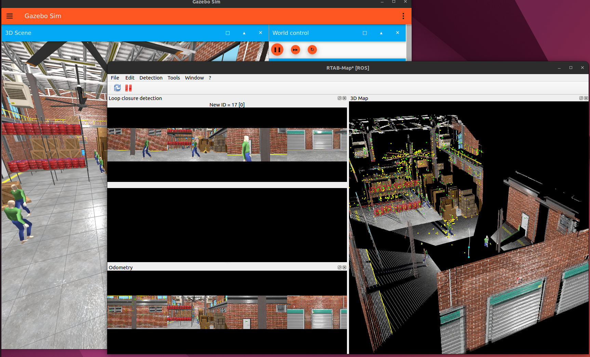

# 🛩️ Airecon - AI-powered aerial monitoring system for industrial anomaly detection
# 제조업 현장의 이상 상황을 감지하는 자율주행 항공 감시 드론 시스템


## 📘 Overview

**Airecon**은 AI 기반 비전 인식과 자율비행 기술을 결합하여  
산업 현장의 이상 상황(화재, 침입, 설비 이상 등)을 실시간으로 탐지하고 대응하는  
**지능형 항공 감시 플랫폼**입니다.
### 산재예방이 점점 더 중요해지면서 이러한 산재들을 효과적으로 예방하기위해 프로젝트를 진행하였습니다.


## 🚀 Key Features

- 🤖 **AI Detection** — 실시간 영상 기반 이상상황 감지 (작업자 복장 확인, 쓰러짐 발견)
- 🛰️ **Autonomous Flight** — 경로 계획 및 비행 제어 (PX4 + ROS 2)
- 🧩 **V-SLAM** — 비전을 이용하여 매핑 후 경로생성
- ☁️ **On Dashboard** — 실시간 모니터링 및 데이터 기록


## 🧱 System Architecture

```text
Airecon
├── main (PX4, ROS 2, Rtabmap slam, YOLO)
│   ├── gimbal_control --> CCTV
│   ├── waypoint_flier --> Waypoint
│   └── px4msgtest --> V-SLAM 매핑
├── arucoland (OpenCV4.10)
    ├── aruco_detector
    ├── precise_land
```


## ⚙️ Tech Stack

| Category | Stack |
|-----------|-------|
| **Flight Control** | PX4, MAVSDK, ROS 2 Humble, QGC |
| **AI / Vision** | PyTorch, YOLOv8n, OpenCV |
| **Communication** | uXRCE-DDS, MAVLink |
| **Backend** | ROS2, flask |
| **Frontend** | QGC, Gazebo_simulation |
| **Hardware** | Pixhawk, Depth Camera |

---


## 🧭 진행순서

- [ ] 공장내부 V-slam을 통한 매핑 진행
- [ ] Waypoint 생성 후 전저리 작업
- [ ] 멀티드론 배치 후 산재예방드론 가동
- [ ] 실시간 상황 YOLO로 분석, 하나의 드론이 임무를 마치면 다음드론이 이어서 임무 수행

---

## 👥 Contributors

| Name | Role | Description |
|------|------|-------------|
| **Holytorch** | 개인 프로젝트 총괄 | System architecture, AI vision, PX4 integration |

---
## 📖 Scenario / Operational Flow


### 📩 산재 예방 드론 의뢰

공장 관리자 또는 안전 담당자가 산재 예방 감시 드론 운용 의뢰


### 🛰️ 공장 현장 방문 및 V-SLAM 매핑

드론을 이용해 실내 공간 V-SLAM 매핑

향후 경로 계획과 비행 안전 확보

```bash
cd ~/path/to/PX4-Autopilot/Tools/simulation/gz
python3 simulation-gazebo --world tugbot_warehouse
```
```bash
make px4_sitl gz_x500_depth
```

- 그 이후 ros_gz 진행 후 ros2 토픽 받아온 후

```bash

source install/setup.bash

ros2 launch px4msgtest rtabmap_sitl.launch.py
```



---


### 🚁 멀티드론 시스템 배치 및 가동

여러 대의 드론을 동시에 배치하여 공장 전체 감시

한 드론의 임무가 끝나면 다른 드론이 자동으로 테이크 오프 후 임무 수행

```bash
cd ~/path/to/PX4-Autopilot/Tools/simulation/gz
python3 simulation-gazebo --world tugbot_warehouse
```
```bash
PX4_SYS_AUTOSTART=4001 PX4_GZ_MODEL_POSE="0,0,0.51" PX4_SIM_MODEL=gz_x500_gimbal ./build/px4_sitl_default/bin/px4 -i 1
```
```bash
PX4_GZ_WORLD=world_demo PX4_SYS_AUTOSTART=4001 PX4_GZ_MODEL_POSE="-3,0,0.51" PX4_SIM_MODEL=gz_x500_gimbal ./build/px4_sitl_default/bin/px4 -i 2
```
```bash
MicroXRCEAgent udp4 -p 8888
```
```bash
ros2 run ros_gz_bridge parameter_bridge \
  /world/world_demo/model/x500_gimbal_1/model/oakd_lite_camera_5/link/camera_link/sensor/StereoOV7251/depth_image@sensor_msgs/msg/Image@gz.msgs.Image \
  /world/world_demo/model/x500_gimbal_1/model/oakd_lite_camera_5/link/camera_link/sensor/IMX214/camera_info@sensor_msgs/msg/CameraInfo@gz.msgs.CameraInfo \
  /world/world_demo/model/x500_gimbal_1/model/oakd_lite_camera_5/link/camera_link/sensor/IMX214/image@sensor_msgs/msg/Image@gz.msgs.Image \
  /world/world_demo/model/x500_gimbal_1/model/oakd_lite_camera_2/link/camera_link/sensor/StereoOV7251/depth_image@sensor_msgs/msg/Image@gz.msgs.Image \
  /world/world_demo/model/x500_gimbal_1/link/camera_link/sensor/camera_imu/imu@sensor_msgs/msg/Imu@gz.msgs.IMU \
  /world/world_demo/model/x500_gimbal_1/link/camera_link/sensor/gimbal/camera_info@sensor_msgs/msg/CameraInfo@gz.msgs.CameraInfo \
  /world/world_demo/model/x500_gimbal_1/link/camera_link/sensor/gimbal/image@sensor_msgs/msg/Image@gz.msgs.Image \
  /world/world_demo/model/x500_gimbal_1/model/oakd_lite_camera_2/link/camera_link/sensor/IMX214/camera_info@sensor_msgs/msg/CameraInfo@gz.msgs.CameraInfo \
  /world/world_demo/model/x500_gimbal_1/model/oakd_lite_camera_2/link/camera_link/sensor/IMX214/image@sensor_msgs/msg/Image@gz.msgs.Image \
  /world/world_demo/model/x500_gimbal_2/model/oakd_lite_camera_5/link/camera_link/sensor/StereoOV7251/depth_image@sensor_msgs/msg/Image@gz.msgs.Image \
  /world/world_demo/model/x500_gimbal_2/model/oakd_lite_camera_5/link/camera_link/sensor/IMX214/camera_info@sensor_msgs/msg/CameraInfo@gz.msgs.CameraInfo \
  /world/world_demo/model/x500_gimbal_2/model/oakd_lite_camera_5/link/camera_link/sensor/IMX214/image@sensor_msgs/msg/Image@gz.msgs.Image \
  /world/world_demo/model/x500_gimbal_2/model/oakd_lite_camera_2/link/camera_link/sensor/StereoOV7251/depth_image@sensor_msgs/msg/Image@gz.msgs.Image \
  /world/world_demo/model/x500_gimbal_2/link/camera_link/sensor/camera_imu/imu@sensor_msgs/msg/Imu@gz.msgs.IMU \
  /world/world_demo/model/x500_gimbal_2/link/camera_link/sensor/gimbal/camera_info@sensor_msgs/msg/CameraInfo@gz.msgs.CameraInfo \
  /world/world_demo/model/x500_gimbal_2/link/camera_link/sensor/gimbal/image@sensor_msgs/msg/Image@gz.msgs.Image \
  /world/world_demo/model/x500_gimbal_2/model/oakd_lite_camera_2/link/camera_link/sensor/IMX214/camera_info@sensor_msgs/msg/CameraInfo@gz.msgs.CameraInfo \
  /world/world_demo/model/x500_gimbal_2/model/oakd_lite_camera_2/link/camera_link/sensor/IMX214/image@sensor_msgs/msg/Image@gz.msgs.Image \
  /model/x500_gimbal_1/command/gimbal_pitch@std_msgs/msg/Float64@gz.msgs.Double \
  /model/x500_gimbal_1/command/gimbal_yaw@std_msgs/msg/Float64@gz.msgs.Double \
  /model/x500_gimbal_2/command/gimbal_pitch@std_msgs/msg/Float64@gz.msgs.Double \
  /model/x500_gimbal_2/command/gimbal_yaw@std_msgs/msg/Float64@gz.msgs.Double
```
```bash
source install/setup.bash

ros2 launch aruco_detector aruco_multi.launch.py
```
```bash
source install/setup.bash

ros2 launch precise_land multi_land.launch.py
```
```bash
source install/setup.bash

ros2 run waypoint_flier multi_drone_mission
```
```bash
source install/setup.bash

ros2 run gimbal_control gimbal_control
```

### 🎯 실시간 상황 분석 및 알람

드론에서 수집된 영상 및 센서 데이터 실시간 분석

작업자 이상 행동, 설비 위험, 쓰러짐 감지 시 즉시 알람

한 대 드론이 임무를 마치면 다음 드론이 자동으로 이어서 감시

     

---

## 📜 License

This project is licensed under the **MIT License** — see the [LICENSE](LICENSE) file for details.

---
